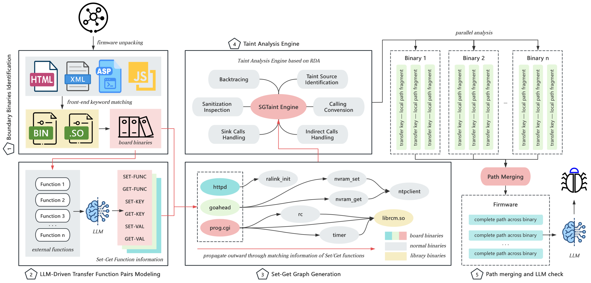

# SGTaint

**SGTaint** is a static taint analysis framework based on **Set-Get Graph** construction, utilizing Reaching Definition Analysis (RDA) to define the analysis scope. It is specifically designed for automated vulnerability detection in IoT firmware. Given the firmware’s file system, SGTaint enables a fully automated analysis process, achieving a balance between efficiency and effectiveness in vulnerability discovery.

## Overview of SGTaint



## Running Environment

To facilitate ease of use and reproducibility, we offer a pre-configured Docker environment that enables immediate execution of **SGTaint**. Additionally, the system can be built from source, allowing for flexible integration and extension in diverse research or practical scenarios.

### Use the compiled docker environment directly

The pre-built Docker image `sgtaint_image` for SGTaint can be obtained from [sgtaint_image.rar](https://pan.sjtu.edu.cn/web/share/0493fa95efc9aad891a1c3c1adbe5ec0)

``````bash
# Loading the Docker Image
docker load -i sgtaint_image.tar
# Creating a New Container from the Image
docker run -it --name SGTaint sgtaint_image:latest
``````

### Or build it from source

For optimal performance and compatibility, the recommended experimental setup consists of **Ubuntu 22.04** with **Python 3.8**. The host machine is expected to have a **minimum of 8 GB of memory** to ensure reliable execution of the analysis framework.

``````bash
# Install system dependencies
sudo apt update
sudo apt install -y $(cat dependencies.txt)
# Install ghidra
./ghidra_install.sh
# Create a Python virtual environment
conda create --name SGTaint python=3.8
# Install Python dependencies
pip install -r requirements.txt
``````

## Instructions for running this tool

Before executing this tool, please create a `.env` file in the root directory of the project (`SGTaint`) to securely store the required API keys. The tool currently supports models from both OpenAI and DeepSeek. The `.env` file should be formatted as follows:

`````ini
OPENAI_API_KEY="sk-xxxxxxxxxxxxxxxxx" # your_openai_api_key_here
DEEPSEEK_API_KEY="sk-xxxxxxxxxxxxxxxxx" # your_deepseek_api_key_here
`````

It is recommended to include only the API key corresponding to the model in use and to ensure that the `.env` file is listed in the `.gitignore` to prevent potential credential leakage.

``````bash
usage: sgtaint [-h] -f FIRMWARE -n NAME -o OUTPUT [-p] [-g] [-l] [-c] [-s SGGRAPH] [-m {gpt,deepseek,qwen}] [-b BOUNDARY] [--version]

optional arguments:
  -h, --help            show this help message and exit
  -f FIRMWARE, --firmware FIRMWARE
                        Path to firmware filesystem
  -n NAME, --name NAME  Firmware identifier
  -o OUTPUT, --output OUTPUT
                        User output directory
  -p, --parallel        Enable parallel mode
  -g, --ghidra          Enable Ghidra-assisted analysis during the decompilation process
  -l, --llm             Enable final LLM check
  -c, --config          Enable retrieving newly identified data reception functions from the configuration
  -s SGGRAPH, --sggraph SGGRAPH
                        Optional SGGraph info path or mode. It can be a file path specifying transfer function pair info (e.g., a list of tuples like [(set_func, get_func,
                        set_key_pos, get_key_pos, set_value_pos, get_value_pos), ...]), or special keywords: 'config' to load transfer function pairs directly from the
                        configuration, 'precise' to use a more accurate method for extracting transfer function pairs.
  -m {gpt,deepseek,qwen}, --model {gpt,deepseek,qwen}
                        Choose LLM model to use (gpt, deepseek or qwen). Default is deepseek.
  -b BOUNDARY, --boundary BOUNDARY
                        Comma-separated list of boundary binary files (absolute paths). Use ',' to separate multiple files.
  --version             show program's version number and exit
``````

### output

Directory structure：

``````bash
|-- output  # Directory storing the final analysis results
|   |-- log  # Contains core analytical outputs
|       |-- <time>_set_get_graph.txt  # Set-Get Graph structure generated by SGTaint at a specific timestamp
|       |-- <firmware_mark>_get2sink_path_complete.json  # Identified data flow paths from Get functions to Sink points without any sanitization
|       |-- <firmware_mark>_get2sink_path_sanitization.json  # Identified data flow paths from Get functions to Sink points after rule_based filtering
|       |-- <firmware_mark>_INFO.md  # Statistical summary of SGTaint framework results
|       |-- <firmware_mark>_path_sanitization_llm_prompt.json  # Identified data flow paths from Source functions to Sink points after rule-based filtering, enriched with LLM prompts
|       |-- <firmware_mark>_potential_path_complete.json  # Identified data flow paths from Source functions to Sink points without any sanitization
|       |-- <firmware_mark>_potential_path_maybe_sorted.json  # Identified data flow paths from Source functions to Sink points possibly missed by filtering, sorted by vulnerability likelihood
|       |-- <firmware_mark>_potential_path_sanitization_sorted.json  # Identified data flow paths from Source functions to Sink points after rule_based filtering, sorted by vulnerability likelihood
|       |-- <firmware_mark>_potential_path_sanitization.json  # Identified data flow paths from Source functions to Sink points after rule_based filtering
|       |-- <firmware_mark>_path_sanitization_llm_check.json  # Identified data flow paths from Source functions to Sink points after rule_based filtering, validated with LLM checks, sorted by vulnerability likelihood
|   |-- vulnerable  # Per-binary vulnerability analysis results
|       |-- <analysis_binary_1>
|           |-- error.txt  # Error messages encountered during RDA-based analysis
|           |-- get2set.txt  # Extracted paths from Source to Set functions within the binary
|           |-- result.txt  # Extracted paths from Source to Sink functions within the binary
|           |-- visited.txt  # List of analyzed functions along with their corresponding timestamps
|   |-- sgtaint.log  # Execution log of the SGTaint framework
|-- tmp  # Temporary directory storing intermediate results
|   |-- BinaryConfig  # Configuration metadata for each binary, utilized in parallel processing
|   |-- BinaryInfo  # Abstracted metadata describing binary-level information
|   |-- BinaryKeyword  # Extracted frontend strings used for binary identification
|   |-- BinaryTmp  # Intermediate outputs generated during the analysis of each binary
|   |-- ghidra  # Directory for Ghidra projects generated from binary files
|   |-- NewGetter  # Directory for Ghidra projects generated from binary files
``````

The file `<firmware_mark>_path_sanitization_llm_check.json`, located in the `log` directory, encapsulates the complete set of potential taint propagation paths identified by **SGTaint**. The structure of these potential paths is defined as follows:

| Field Name             | Data Type         | Description                                                  |
| ---------------------- | ----------------- | ------------------------------------------------------------ |
| `kind`                 | string            | Indicates the type of taint propagation path, such as `intra-single`, denoting an intra-procedural path within a single function, or `cross`, which represents a cross-binary data flow spanning multiple binary executables. |
| `vulnerability_type`   | string            | Human-readable vulnerability classification (e.g., `buffer overflow`, `command injection`). |
| `checking_time`        | int               | The number of explicit filtering or validation operations observed along the taint path within the binary (e.g., conditional checks, length validation, sanitization functions). A higher value suggests stronger in-path defense mechanisms before reaching the sink. |
| `source_function_name` | string            | The decompiled name of the function containing the taint source, marking the entry point of the analysis. |
| `taint_source`         | string            | The identified source of taint, typically an input-related function (e.g., `fgets`, `websGetVar`). |
| `source_insr_addr`     | string (hex)      | The instruction address where the taint source is located, represented in hexadecimal format. |
| `start_block`          | int               | The basic block address where taint propagation begins.      |
| `source_keyword`       | string            | A keyword associated with the taint source, often used for identifying hardcoded strings or constants. |
| `merge`                | boolean           | A flag indicating whether the current path is a result of merging multiple paths. |
| `binary`               | list of strings   | A list of binary files in which the taint path is observed, supporting multi-binary analysis. |
| `taint_sink`           | string            | The identified taint sink function (e.g., `strcat`, `system`), representing a potential vulnerability endpoint. |
| `sink_insr_addr`       | string (hex)      | The instruction address where the taint sink occurs, in hexadecimal form. |
| `end_block`            | int               | The basic block address at which taint propagation terminates. |
| `path`                 | dictionary        | A mapping of binary file names to their corresponding taint paths, represented as a list of instruction address transitions: `{binary: [addr#addr, ...]}`. |
| `visited_functions`    | string            | A concatenated list of function names traversed during path exploration, used to capture interprocedural context. (delimiter `#`). |
| `decompile_list`       | list of strings   | A sequence of decompiled code snippets corresponding to the identified taint path. |
| `complete_list`        | list of strings   | A sequence of full decompiled code corresponding to the identified taint path. |
| `range_list`           | list of [int,int] | Line ranges (inclusive) within `complete_list` corresponding to the tainted region (e.g., `[[start, end], ...]`). |
| `front_end_keyword`    | string            | Front-end keyword or parameter name mapped to the source (e.g., `"mac"`). |
| `front_end_file_path`  | list of strings   | Paths to front-end files (HTML/JS/ASP) that reference the `front_end_keyword`. |
| `LLM_judge`            | boolean           | Whether an LLM was used to assess the path (true/false).     |
| `LLM_response`         | string            | LLM's textual assessment (structured or free text) describing exploitability, CWE, rationale, suggested tests. |
| `LLM_time`             | number (float)    | Time taken by the LLM check in seconds (wall-clock).         |

### Our dataset

The dataset can be obtained from [SGTaint_dataset.zip](https://pan.sjtu.edu.cn/web/share/88f0281cf6e4642aedd3af277eba41e9)

### Case Study

1. **Conduct vulnerability analysis on the D-Link DIR-878 firmware in serial mode**, leveraging sequential execution to traverse and evaluate the entire firmware codebase.

``````bash
python -m tool.sgtaint -f /home/firmware/Current_dataset/D-Link/DIR-878/cpio-root -n DIR-878 -o /home/output/DIR-878
``````

2. **Perform parallelized vulnerability analysis on the D-Link DIR-878 firmware with LLM-assisted post-analysis**, enabling concurrent binary processing while incorporating a Large Language Model for enhanced semantic validation.

``````bash
python -m tool.sgtaint -f /home/firmware/Current_dataset/D-Link/DIR-878/cpio-root -n DIR-878 -o /home/output/DIR-878 -p -l
``````

3. **Execute parallel vulnerability analysis on the D-Link DIR-878 firmware with user-specified Set/Get function definitions**, allowing for customized taint graph construction based on domain-specific knowledge of data access semantics.

``````
python -m tool.sgtaint -f /home/firmware/Current_dataset/D-Link/DIR-878/cpio-root -n DIR-878 -o /home/output/DIR-878 -s "[(nvram_bufset, nvram_bufget, 1, 1, 2, None), (nvram_safe_set, nvram_safe_get, 0, 0, 1, None)]" -p -l
``````

### 0-day Vulnerabilities

The detailed information of the 0-day vulnerabilities discovered by SGTaint will also be made publicly available at [0-day](https://github.com/yifan20020708/SGTaint-0-day)